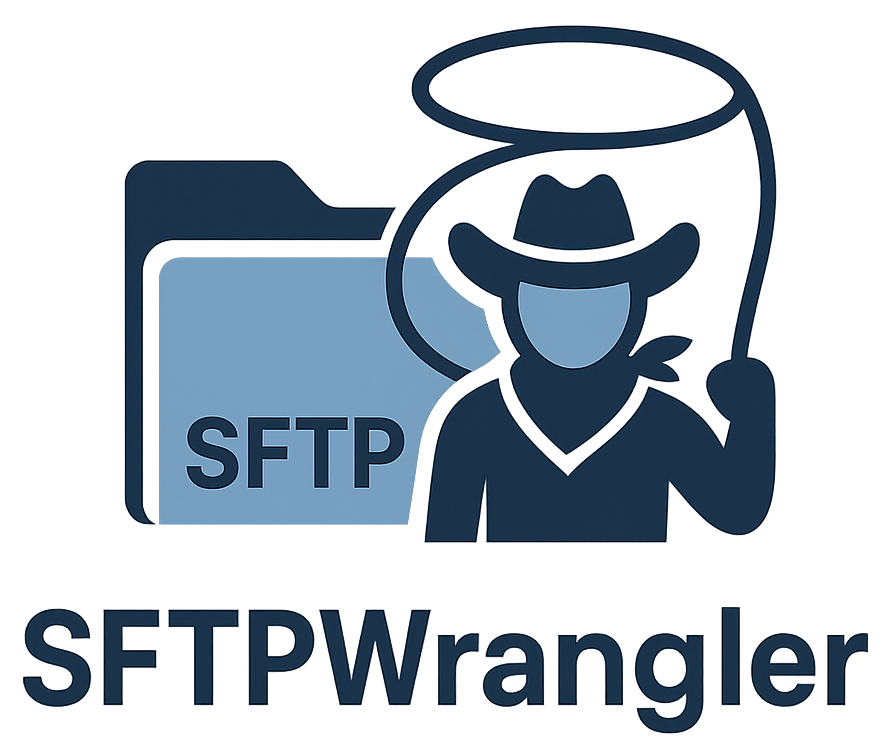
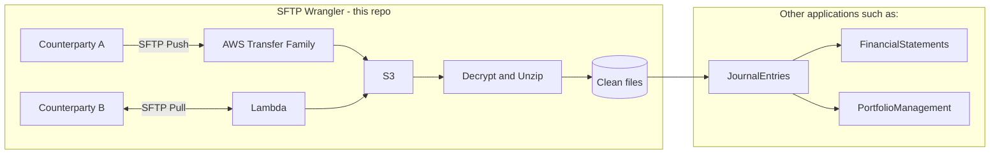

<div align="center">
  
</div>

# SFTP Wrangler
[](https://github.com/Titanium-Birch/SFTPWrangler/actions/workflows/push_branch.yaml)

This project demonstrates how [Titanium Birch](https://www.titaniumbirch.com), an investment firm, manages its SFTP infrastructure. We created this solution because some of our counterparties can only deliver data to us via SFTP rather than APIs. We hope this code helps others who work with SFTP and want to minimise the time and effort spent managing it. We use the MIT license.

## Introduction

### Why is this noteworthy?
It's a low-maintenance way to handle SFTP push and pull operations.

### What problem does it solve?

Operating SFTP servers and doing it well can be a lot of work. Luckily, AWS's **Transfer Family** provides SFTP servers "as a service", meaning users don't need to deal with operating/monitoring/patching/securing/etc the servers. That's a big chunk of the value. Thank you, AWS! This repo is mostly "infrastructure as code" using Terraform to configure Transfer Family and a few other AWS services around it.

In short, this repo lets us:
- **input:** configuration about SFTP counterparties
- **output:** files reliably flow from SFTP into an S3 bucket, decrypted, unzipped, and cleaned up so they're ready to be used in other applications downstream

### How does it do that?

Key parts are:
- **AWS Transfer Family** - this service lets us operate always-on SFTP servers without having to do any sysadmin work ourselves to keep servers up and secured.
- **AWS Lambda** - runs Python code in a "serverless" way, again without any need for sysadmin work. It covers actions such as decrypting and unzipping files when counterparties deliver new files via SFTP, performing scheduled SFTP pulls for counterparties that prefer pull over push, and other data retrieval and cleanup tasks.
- **Terraform** - describes and provisions all infrastructure.
- **Cloudwatch** - monitoring and alerting.
- **Devcontainer** - makes development easy and reduces security risks to workstations.
- **Pytest** - for automated tests.

There's also code that pulls files from other sources, such as REST APIs, though the most interesting part of this repo is the SFTP flow. Nowadays we would use DLT to load data from REST APIs instead of how it's done here.

### What are the security risks?

We believe the risks are lower than trying to operate SFTP servers oneself directly.
See the [threat model](./threat-modeling/THREAT_MODEL.md) for details.

### Flowchart



## Highlights of Technologies Used

- Various **AWS services** - see `/modules/` for the Terraform configs. This repo is purposely "AWS only", not cross-cloud.
- **Python packages**: see `pyproject.toml`. Managed via `poetry`.
- **Pytest** for unit and integration tests
- **Docker** for 1) devcontainers, 2) to provide the image on which to run AWS Lambdas so they can do GPG decryption 3) integration tests. See `docker-compose.yml`
- **Localstack** for mocking AWS services in tests
- **Terraform** to describe infrastructure
- **atmoz/sftp** for SFTP servers in integration tests

## Folder structure

- **`.cursor/`** - Rules for AI agents in the Cursor IDE
- **`.devcontainer/`** - Instructs IDEs supporting the devcontainer standard (such as VSCode and others) how to use Docker to run the development environment.
- **`.github/`** - Configures Github Actions to run tests.
- **`examples/`** - Usage examples and setup configurations for different deployment scenarios.
- **`layers/`** - Pre-built AWS extensions that get bundled into the Lambda runtime environment.
- **`modules/`** - Configuration for the `Terraform` tool. It describes the expected state of AWS infrastructure, which Terraform then automatically creates.
- **`src/`** - Python source code for all Lambda functions handling data ingestion and processing such as SFTP pull, GPG decryption, unzipping, converting XLSX to CSV, and other steps to "get the data clean enough to be useful to downstream applications."
- **`tests/`** - Comprehensive test suite including unit and integration tests.


## S3 Bucket Stages

Files flow through S3 buckets in this order:

1. **Upload Bucket** - Initial landing zone for all incoming data
2. **Incoming Bucket** - Temporary processing area for data validation
3. **Categorized Bucket** - Processed data organized by categories and peers
4. **Files Bucket** - Final storage for transformed and validated data
5. **Backfill Categories Temp Bucket** - Temporary storage for batch processing operations

Each stage is handled by Lambda functions that can be customized based on the `peers_config` and `features` variables.

## AWS Resources Created

The module creates the following AWS resources. Some resources are conditionally created based on `peers_config` and `features` configuration:

### Core Infrastructure
- **VPC** with public/private subnets and security groups
- **S3 Buckets** (5 buckets)
- **IAM Roles and Policies** for secure service communication
- **CloudWatch Log Groups** for monitoring and debugging

### Data Processing
- **Lambda Functions** (Python-based):
  - Pull function for SFTP data retrieval
  - Upload processing function
  - Incoming data validation function
  - API integration functions
  - Admin task functions
  - Secret rotation functions
- **ECR Repository** for Lambda container images. We run the Lambdas on their own Docker images to handle GPG decryption.
- **EventBridge Rules** for scheduled data ingestion

### Optional Features (based on configuration)
- **Transfer Family SFTP Server** (when push_server is enabled)
- **Elastic IP** for SFTP server (when lock_elastic_ip is enabled, useful when a counterparty requires a static IP address)
- **API Gateway** for webhook endpoints
- **App Config** for dynamic configuration management
- **Secrets Manager** for secure credential storage
- **Backup Infrastructure** (when create_backups is enabled)

### Monitoring and Management
- **CloudWatch Metrics** for custom monitoring
- **CloudWatch Alarms** for alerting
- **EventBridge** for event-driven processing

## Development Environment

### Prerequisites

This project is designed to be opened in an IDE that supports `.devcontainer` for a consistent development environment. The devcontainer includes all necessary tools and dependencies.

**Recommended IDEs:**
- Visual Studio Code with Dev Containers extension
- Cursor
- JetBrains IDEs with dev container support
- GitHub Codespaces

### Setup

1. **Clone the repository**:
   ```bash
   git clone <repository-url>
   cd SFTPWrangler
   ```

2. **Open in devcontainer**:
   - In VS Code: Use "Dev Containers: Reopen in Container" command
   - In other IDEs: Follow your IDE's devcontainer documentation

3. **Dependencies are automatically installed** - The devcontainer handles all dependency installation via the `postCreateCommand.sh` script

## Testing

The project uses Poetry for dependency management and pytest for testing with two types of test suites:

### Unit Tests
Run unit tests that don't require external dependencies:
```bash
poetry run python -m pytest -m unit
```

### Integration Tests
Run integration tests that use Docker containers with LocalStack and SFTP services:
```bash
poetry run python -m pytest -m integration
```

**Integration Test Dependencies:**
- **LocalStack**: Simulates AWS services locally
- **atmoz/sftp**: Provides SFTP server for testing

**Automatic Docker Management:**
Integration tests use the `pytest-docker` plugin, which automatically:
- Starts Docker Compose services defined in `docker-compose.yml` when integration tests begin
- Waits for all services to be healthy before running tests (using the `composed_environment` fixture)
- Cleans up and stops all containers when tests complete
- Downloads required Docker images as needed

No manual `docker compose up` is required - the testing framework handles all container lifecycle management.

### Test Coverage
```bash
# Run all tests with coverage
poetry run python -m pytest --cov=src

# Generate coverage report
poetry run python -m pytest --cov=src --cov-report=html
```

## Configuration

### Required Variables

- `environment`: Logical environment name for resource prefixing
- `peers_config`: List of peer configurations defining data sources

### Optional Variables

- `namespace`: General namespace for AWS resource prefixing
- `project`: Project name for AWS resource prefixing  
- `sftp_push_default_user_public_key`: SSH public key for default SFTP user
- `cidr`: VPC CIDR block (default: "10.0.0.0/16")
- `features`: Feature flags for optional infrastructure components

### Example Configuration

```hcl
module "sftpwrangler" {
  source = "./modules/all"
  
  environment = "production"
  namespace   = "mycompany"
  project     = "financial-data"
  
  peers_config = [
    {
      id       = "bank-sftp"
      name     = "Bank SFTP"
      method   = "pull"
      hostname = "sftp.bank.com"
      port     = 22
      username = "bank_user"
      # 🔐 REQUIRED for production security
      host-sha256-fingerprints = ["SHA256:nThbg6kXUpJWGl7E1IGOCspRomTxdCARLviKw6E5SY8"]
      schedule = "0 2 * * *"
      categories = [
        {
          category_id       = "transactions"
          filename_patterns = ["*.csv"]
          transformations   = ["RemoveNewlinesInCsvFieldsTransformer"]
        }
      ]
    }
  ]
  
  features = {
    push_server = {
      enabled         = true
      lock_elastic_ip = true
    }
    s3 = {
      can_be_deleted_if_not_empty = false
      create_backups              = true
    }
  }
}
```

## Security Features

- **VPC Isolation**: All resources deployed in dedicated VPC
- **IAM Least Privilege**: Minimal required permissions for each service
- **Encryption**: S3 buckets and data in transit encrypted
- **Secrets Management**: Sensitive data stored in AWS Secrets Manager
- **Network Security**: Security groups restrict access appropriately
- **SFTP Host Verification**: Configurable fingerprint validation for secure SFTP connections

### SFTP Security Best Practices

⚠️ **CRITICAL**: For production SFTP pull operations, **always configure host fingerprints** to prevent man-in-the-middle attacks.

**Production Configuration:**
```hcl
host-sha256-fingerprints = ["SHA256:nThbg6kXUpJWGl7E1IGOCspRomTxdCARLviKw6E5SY8"]
```

**Development Only** (⚠️ insecure):
```hcl
# host-sha256-fingerprints = []  # Omit for dev/test only
```

> **Note**: Obtain expected fingerprints through secure, out-of-band channels from your counterparty.

## Monitoring

The infrastructure includes comprehensive monitoring through:
- Custom CloudWatch metrics for data ingestion tracking
- CloudWatch logs for all Lambda functions
- Configurable alerting for failed ingestion processes
- EventBridge events for pipeline state tracking

## Examples

See the `examples/` directory for complete usage examples, including:
- Basic setup with multiple ingestion methods
- Production-ready configurations
- Environment-specific deployments

For detailed setup instructions, see [examples/README.md](examples/README.md).

## Contributing

1. Ensure your IDE supports .devcontainer for consistent development environment
2. Run tests before submitting changes:
   ```bash
   poetry run python -m pytest -m unit
   poetry run python -m pytest -m integration
   ```
3. Ensure CI passes on your pull request (tests run automatically)
4. Follow existing code style and patterns
5. Update documentation for any new features

Looking for ideas on what to contribute? See the [threat model](/threat-modeling/THREAT_MODEL.md)
for a list of mitigations you could add to reduce security risks.

## Disclaimer

This code is provided as a snapshot of how we solved SFTP ingestion at Titanium Birch in 2023–2025. This repo is not actively maintained and may require adaptation for your environment. Use at your own risk.

## About Titanium Birch

[Titanium Birch](https://www.titaniumbirch.com) is an evergreen investment firm backed by a single principal. We take no outside capital, which gives us the freedom to move fast, dive deep, and think long term.

We’re sharing this code in the hope it helps others facing similar operational challenges. It’s a snapshot of a real-world implementation at Titanium Birch, built to minimise toil, make data useful, and free up bandwidth for deeper analysis and better decision-making.

[Check out our blog](https://www.titaniumbirch.com/blog) to learn more about our approach to all kinds of topics, like accounting for investments, portfolio reporting, and more.
