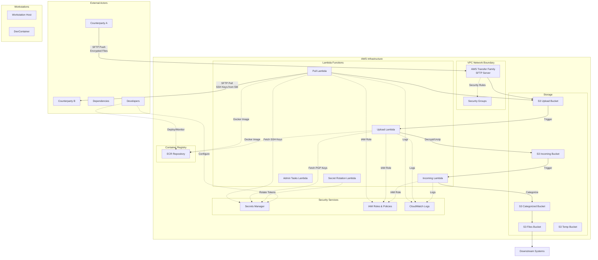

# Threat Model for SFTP Wrangler

Transfering data in files via SFTP is risky and inconvenient.
Ideally, we wish we didn't need to do it.
We'd much prefer to use APIs instead.
However, some counterparties simply can only work with SFTP, so we need to adapt.

In addition, some counterparties insist on sending data both ZIP'ed (hardly necessary
given the small data volumes and compression built into the transport layers) as well
as GPG encrypted (also hardly necessary given the existing protections in SFTP).
The code to decrypt and unzip presents additional attack surfaces.

Below is an attempt at describing what could go wrong and how this system tries to 
manage the risks.

## Scope for this threat model

This document describes threats that an organisation will likely face when choosing to use SFTP Wrangler.

Out of scope:
- hardening AWS account(s)  including incident detection and response.
- non-SFTP methods like Wise and Arch APIs (todo: remove those from SFTP Wrangler)
- hardening developer workstations beyond the devcontainer setup described here

## Data Flow Diagram

## Assets

1. **Business Data Arriving via SFTP**
   - Files received from counterparties (any data type)
   - Processed and transformed data
   - Classification: Confidential/Restricted
   - Locations: S3 buckets, Lambda memory, SFTP channels

2. **Credentials & Cryptographic Material** 
   - SSH private keys for SFTP pull to authenticate to counterparties
   - PGP/GPG private keys for file decryption
   - AWS credentials
   - Classification: Secret
   - Locations: AWS Secrets Manager, Lambda memory, 1Password, Github Actions, Workstation devcontainers

3. **Infrastructure Configuration & Code**
   - Lambda function code and container images
   - Terraform infrastructure code
   - SSH public keys authorized to perform SFTP push into AWS Transfer Family
   - Configuration, including the expected SSH fingerprints of servers for SFTP pull
   - Classification: Internal
   - Locations: ECR, Github, Workstations

## Threats

- Attacker **accesses, deletes or modifies business data**:
  - by stealing an **SSH private key** and doing SFTP pull from a counterparty's servers
  - by **man-in-the-middle'ing** us or a counterparty for SFTP push or pull
  - through **remote-code-execution** in:
    - our Lambdas and exfiltrating data from memory or S3
    - the SFTP servers operated by AWS Transfer Family
  - by introducing **malicious code** to production:
    - via **dependencies** in:
      - VSCode Extensions
      - Devcontainer Features
      - Packages installed via Docker
      - Packages installed via Poetry for Python
    - by committing it into this repo and getting it past code-review
- Attacker **compromises workstations**:
  - by:
    - introducing **malicious code via dependencies**
    - tricking humans into **opening malicious files delivered by SFTP**
  - and:
    - steals **credentials or secrets**
      - from workstations, if present
      - from CI
    - modifies source-code to **introduce vulnerabilities**
- Attacker causes **wrong/malicious data** to get used by downstream applications
- Attacker causes **crashes, denial of service**, by introducing malicious files such as ZIP bombs

## Mitigations

SFTP Wrangler employs the follow mitigations to reduce the risks of the above threats.

### Mitigations on Workstations

- All code, including IDE extensions, run in a container only via the devcontainer standard. Keep the host clean.
- By policy and design: no confidential data on workstations (ie: the SFTP files don't touch workstations).
- For most development, there's no need for credentials in the container. If/when it's necessary to authenticate
  to AWS, in order of preference:
    - rely on CI to run terraform and have github actions authenticate to AWS via OIDC
    - as a last resort: authenticate the workstation using `aws configure sso` to create short-lived credentials
- Other credentials like SSH and GPG keys never touch disk:
  - generated in RAM-only Docker containers, then pasted into 1Password
  - stored in 1Password, copied to AWS Secrets Manager
- by design: the end of the pipeline is CSV files only. No ZIP, GPG, XLSX, etc., to further the reduce the risk 
  of a human deciding to open dangerous files on their machines.

### Mitigations on Github
- Github actions: authenticate to AWS using OIDC. Never use IAM users.
- Github branches:
  - require reviews before merging PRs
  - no pushing to main

### SFTP authentication
- SFTP Pull: in configuration, define the expected SSH key fingerprint for the counterparty's SFTP server. Error if the key does not match.
- SFTP Push: users and the counterparty must exchange the SSH key fingerprint of AWS Transfer Family isntance out-of-band.

### SFTP authorization
- SSH keys only, no passwords

### Dependencies
- Github dependabot scans and alerts when dependencies have known vulnerabilities
- Dependencies are only defined via dockerfile, devcontainer, and poetry config
- Hold a person accountable for resolving dependabot issues in a reasonable timeframe
- By policy and habit: in PRs that propose changes to dependencies (including VSCode extensions): proactively decide whether to trust the authors and document the decision and its rationale. use a framework for how to make such decisions. See details below.
- Infrastructure: in general, this system by design mitigates various threats from unpatched infrastructure by relying on AWS to operate the infra. Other than keeping our software application patched, there's no need for us to patch infrastructure.

### Application code
- Prevent path traversals via malicious ZIP files
- Train and incentivise developers in defensive coding, especially when dealing with untrusted inputs

## Dependencies

Processes for deciding which dependencies to trust:
- [python_dependencies.md](./python_dependencies.md)
- [vs_code_extensions_and_features.md](./vs_code_extensions_and_features.md)

## Backlog of additional mitigations

The following measures would further reduce risks.

- Reduce blast-radius from remote-code-execution in any Lambda. Review and try to further tighten IAM permissions of lambdas that process untrusted files. Make it so a compromised lambda cannot gain access to confidential information.

1. **Enforce SFTP Host Fingerprint Verification (T1.1)**
   - Make host fingerprints mandatory for production deployments
   - Add Terraform validation to prevent empty fingerprint lists in production
   - Document secure fingerprint exchange process with counterparties

   - to research: **Lock File Verification**: Enable hash verification in Poetry lock files

2. **Enhance File Upload Validation (T2.1)**
   - Add file size limits (e.g., 100MB) to prevent resource exhaustion
   - Implement zip bomb detection (max extraction ratio, nested depth)
   - Add virus scanning integration with Lambda
   - Validate file signatures/magic bytes

### **Runtime Security & Sandboxing**

**Lambda Runtime Restrictions:**
- Use Lambda container images with minimal base images (distroless, alpine)
- Implement seccomp profiles to restrict available system calls
- Use AWS Lambda Powertools for structured logging and anomaly detection
- Deploy Lambdas in private VPC subnets with no internet access
- Use VPC endpoints for required AWS services only

**Process Isolation:**
- Run file processing in separate child processes with restricted privileges
- Use Python `subprocess` with limited capabilities and timeouts
- Implement memory and CPU limits per file processing operation
- Remove unnecessary tools from Lambda execution environment
- Disable shell access and command execution capabilities

### **Enhanced Input Validation & Sanitization**

**Content-Based Validation:**
- Implement strict MIME type validation beyond magic bytes
- Add entropy analysis to detect suspicious files (encrypted payloads, etc.)
- Validate file structure before processing (ZIP directory, Excel sheet counts)
- Implement allowlists for acceptable file characteristics
- Use `defusedxml` instead of standard XML parsers for safer parsing

**Parser Hardening:**
- Pin exact dependency versions and audit regularly
- Use read-only parsing modes where available
- Implement parser-specific timeouts and resource limits
- Consider alternative, more secure parsing libraries

### **Monitoring & Detection**

**Behavioral Analysis:**
- Monitor Lambda execution patterns for anomalies (duration, memory, network)
- Implement CloudWatch custom metrics for file processing characteristics
- Alert on unexpected library imports or function calls
- Track file processing success/failure rates and patterns

**Runtime Security Monitoring:**
- Use AWS GuardDuty for Lambda threat detection
- Implement custom CloudWatch Logs analysis for RCE indicators
- Monitor for unexpected outbound network connections
- Track temporary file creation patterns

### **Architectural Security**

**Multi-Stage Processing:**
- Implement "triage" Lambda with minimal permissions for file validation/classification
- Use separate Lambdas per processing stage with stage-specific permissions
- Implement checkpoints between stages to validate intermediate results

**Quarantine System:**
- Hold suspicious files in quarantine bucket for manual review
- Implement automatic quarantine based on file characteristics or anomalies
- Use separate IAM roles for quarantine operations

### **Advanced Security Measures**

**Static Analysis Integration:**
- Run static analysis on uploaded files before processing
- Implement YARA rules for malware detection
- Use AWS Macie for sensitive data detection and classification

**Cryptographic Verification:**
- Implement file integrity checking with expected hashes
- Use digital signatures for file authenticity verification
- Implement "trust score" based on file source and characteristics

**Backup & Recovery:**
- Implement immutable backups with versioning
- Use S3 Object Lock for critical data protection
- Implement automated recovery procedures for compromised environments

### **Development & Deployment Security**

**Supply Chain Hardening:**
- Use container image signing and verification
- Implement reproducible builds with build attestation
- Use dependency vulnerability scanning in CI/CD pipeline
- Consider AWS CodeArtifact for dependency management

**Testing & Validation:**
- Implement fuzzing for file processing functions
- Use property-based testing for input validation
- Create test suite with known malicious files
- Implement chaos engineering for resilience testing

- tighten linting requirements
- TODO: fuzz-testing file-processing?
- TODO: limit file sizes?
- TODO: suggest/faciliate disabling of unneeded risky functionality like processing XLSX, ZIP, GPG.
- TODO: mitigate ZIP-bombs:
  - overwriting files
  - spamming too many files (maybe even require just a single file inside each ZIP and GPG)
  - traversing paths (might already be covered)
  - error on huge files. avoid resource exhaustion.
- TODO: for push: mention a step of sharing our host-key to the counterparty
- TODO: mention hardening SFTP crypto
- TODO: github actions "features", like Mr Snok

---

*This threat model was last updated on 2025-08-14.*

This threat model should be reviewed and updated:
- **Annually**: Regular security review cycle
- **When**: Major system changes or new integrations
- **If**: Security incidents or new threat intelligence

**Next Review Should Be Before**: 2026-03-01
