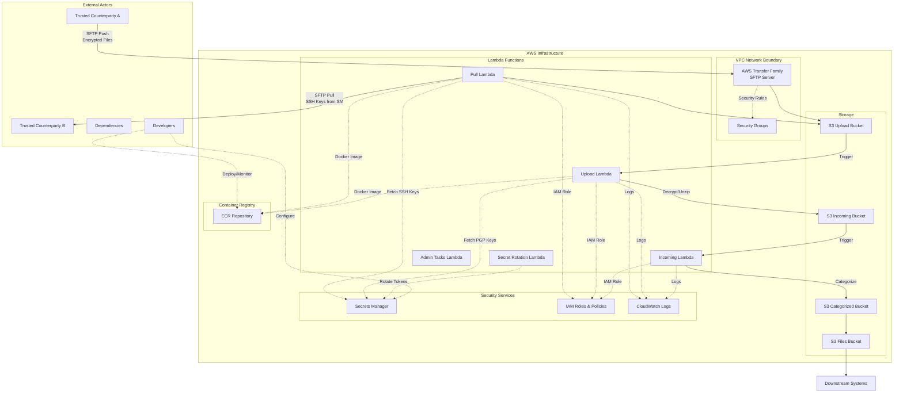

# Threat Model for SFTP Wrangler

Transfering data in files via SFTP is risky and inconvenient.
Ideally, we wish we didn't need to do it.
We'd much prefer to use APIs instead.
However, some counterparties simply can only work with SFTP, so we need to adapt.

In addition, some counterparties insist on sending data both ZIP'ed (hardly necessary
given the small data volumes and compression built into the transport layers) as well
as GPG encrypted (also hardly necessary given the existing protections in SFTP).
The code to decrypt and unzip presents additional attack surfaces.

Below is an attempt at describing what could go wrong and how this system tries to 
manage the risks.

## Scope for this threat model

This document describes threats that an organisation will likely face when choosing to use SFTP Wrangler.

Out of scope:
- hardening AWS account(s)  including incident detection and response.
- non-SFTP methods like Wise and Arch APIs (todo: remove those from SFTP Wrangler)
- hardening developer workstations beyond the devcontainer setup described here

Assumptions:
- the counterparties sending us files by SFTP are reasonably trusted. The chances of the files being
  malicious are not high.

## Data Flow Diagram

## Assets

1. **Business Data Arriving via SFTP**
   - Files received from counterparties (any data type)
   - Processed and transformed data
   - Classification: Confidential/Restricted
   - Locations: S3 buckets, Lambda memory, SFTP channels

2. **Credentials & Cryptographic Material** 
   - SSH private keys for SFTP pull to authenticate to counterparties
   - PGP/GPG private keys for file decryption
   - AWS credentials
   - Classification: Secret
   - Locations: AWS Secrets Manager, Lambda memory, 1Password, Github Actions, Workstation devcontainers

3. **Infrastructure Configuration & Code**
   - Lambda function code and container images
   - Terraform infrastructure code
   - SSH public keys authorized to perform SFTP push into AWS Transfer Family
   - Configuration, including the expected SSH fingerprints of servers for SFTP pull
   - Classification: Internal
   - Locations: ECR, Github, Workstations

## Threats

- Attacker **accesses, deletes or modifies business data**:
  - by stealing an **SSH private key** and doing SFTP pull from a counterparty's servers
  - by **man-in-the-middle'ing** the relevant side for SFTP push or pull
  - through **remote-code-execution** in:
    - our Lambdas and exfiltrating data from memory or S3
    - the SFTP servers operated by AWS Transfer Family
  - by introducing **malicious code** to production:
    - via **dependencies** in:
      - VSCode Extensions
      - Devcontainer Features
      - Packages installed via Docker
      - Packages installed via Poetry for Python
      - Github Actions features, some of which are provided by third parties
    - by committing into this repo and getting it past code-review
- Attacker **compromises workstations**:
  - by:
    - introducing **malicious code via dependencies**
    - tricking humans into **opening malicious files delivered by SFTP**
  - and:
    - steals **credentials or secrets**
      - from workstations, if present
      - from CI
    - modifies source-code to **introduce vulnerabilities**
- Attacker causes **wrong/malicious data** to get used by downstream applications
- Attacker causes **crashes, denial of service**, by introducing malicious files such as ZIP bombs

## Mitigations

SFTP Wrangler employs the follow mitigations to reduce the risks of the above threats.

### Mitigations on Workstations

- All code, including IDE extensions, run in a container only via the devcontainer standard. Keep the host clean.
- By policy and design: no business data on workstations (ie: the SFTP files don't touch workstations).
- For most development, there's no need for credentials in the container. If/when it's necessary to authenticate
  to AWS, in order of preference:
    - rely on CI to run terraform and have github actions authenticate to AWS via OIDC
    - as a last resort: authenticate the workstation using `aws configure sso` to create short-lived credentials
- Other credentials like SSH and GPG keys never touch disk:
  - generated in RAM-only Docker containers, then pasted into 1Password
  - stored in 1Password, copied to AWS Secrets Manager
- by design: the end of the pipeline is CSV files only. No ZIP, GPG, XLSX, etc., to further the reduce the risk 
  of humans opening dangerous files on their machines.

### Mitigations on Github
- Github actions: authenticate to AWS using OIDC. Never use IAM users.
- Github branches:
  - require reviews and green CI before merging PRs
  - no pushing to main

### SFTP authentication
- SFTP Pull: in configuration, define the expected SSH key fingerprint for the counterparty's SFTP server. Error if the key does not match.
- SFTP Push: users and the counterparty must exchange the SSH key fingerprint of AWS Transfer Family instance out-of-band. This is easy to forget and some counterparties don't support pinning fingerprints, so this is a fundamental weakness in the system because of its usage of SFTP.

### SFTP authorization
- SSH keys only, no passwords

### Dependencies
- Github dependabot scans and alerts when dependencies have known vulnerabilities
- Dependencies are only defined via dockerfile, devcontainer, and poetry config
- Hold a person accountable for resolving dependabot issues in a reasonable timeframe
- By policy and habit: in PRs that propose changes to dependencies (including VSCode extensions): proactively decide whether to trust the authors and document the decision and its rationale. use a framework for how to make such decisions. See details below.
- Infrastructure: in general, this system by design mitigates various threats from unpatched infrastructure by relying on AWS to operate the infra. Other than keeping our software application patched, there's no need for us to patch infrastructure.

### Application code
- Prevent path traversals via malicious ZIP files
- Train and incentivise developers in defensive coding, especially when dealing with untrusted inputs

## Dependencies

Processes for deciding which dependencies to trust:
- [python_dependencies.md](./python_dependencies.md)
- [vs_code_extensions_and_features.md](./vs_code_extensions_and_features.md)

## Backlog of additional mitigations

The following measures would further reduce risks but aren't yet implemented.

### Lambda Security Hardening

**Reduce blast-radius from remote-code-execution in any Lambda:**
- Where practical, use custom file-processing steps in Transfer Family, especially for SFTP Push.
- Further tighten IAM permissions of lambdas that process untrusted files. Further restrict S3 and AWS Secrets access.
- Make the lambdas offline. They don't need Internet access.
- Consider stringing the stages together with queues to remove S3 access entirely.

### SFTP Security Enhancements

1. **Harden SFTP settings**
   - Make host fingerprints mandatory for production deployments
   - For SFTP push: strengthen reminders that users have to share their host-key with the counterparty
   - Harden SFTP crypto settings, though sadly many counterparties require outdated settings

2. **Lock File Verification** (to research)
   - Enable hash verification in Poetry lock files

### File Processing Security

3. **Enhance File Upload Validation (T2.1)**
   - Add file size limits (e.g., 100MB) to prevent resource exhaustion
   - Implement zip bomb detection (max extraction ratio, nested depth)
   - Add virus scanning integration with Lambda
   - Validate file signatures/magic bytes

4. **Content-Based Validation**
   - Implement strict MIME type validation beyond magic bytes
   - Add entropy analysis to detect suspicious files (encrypted payloads, etc.)
   - Validate file structure before processing (ZIP directory, Excel sheet counts)
   - Implement allowlists for acceptable file characteristics
   - Use `defusedxml` instead of standard XML parsers for safer parsing

### Monitoring and Detection

5. **Behavioral Analysis**
   - Monitor Lambda execution patterns for anomalies (duration, memory, network)
   - Implement CloudWatch custom metrics for file processing characteristics
   - Alert on unexpected library imports or function calls
   - Track file processing success/failure rates and patterns

6. **Runtime Security Monitoring**
   - Use AWS GuardDuty for Lambda threat detection
   - Implement custom CloudWatch Logs analysis for RCE indicators
   - Monitor for unexpected outbound network connections
   - Track temporary file creation patterns

### Development and Operations

7. **Code Quality and Security**
   - Tighten linting requirements
   - Suggest/facilitate disabling of unneeded risky functionality like processing XLSX, ZIP, GPG

---

*This threat model was last updated on 2025-08-14.*

This threat model should be reviewed and updated:
- **Annually**: Regular security review cycle
- **When**: Major system changes or new integrations
- **If**: Security incidents or new threat intelligence

**Next Review Should Be Before**: 2026-03-01
